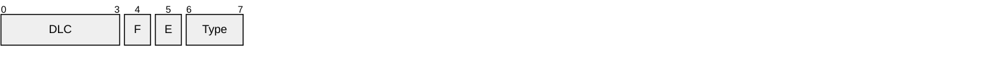

# Waveshare USB-CAN-A C++ Library
This is a C++ library for interfacing with the Waveshare USB-CAN-A device. The library provides functions to initialize the device, send and receive CAN messages using CANOpen standards, and configure USB adapter settings.
## Features
- Initialize and configure the USB-CAN-A device
- Send and receive CAN messages with both fixed and variable length frames
- Support for both standard (11-bit - CAN 2.0A) and extended (29-bit - CAN 2.0B) CAN IDs
- Error handling and status reporting

## Quick Start / Usage Example

For a quick start guide, see the `scripts` directory. Here, you can find simple programs demonstrating how to use the library to send and receive CAN messages.

- `wave_reader.cpp`: A simple program that reads messages that arrive on the USB adapter and prints them to the console.
- `wave_writer.cpp`: A simple program that sends a predefined CAN message every second. You can modify the message ID and data in the source code.
- `wave_bridge.cpp`: A program that bridges messages between a SocketCAN interface and the Waveshare USB-CAN-A device.

The steps to run the examples are:
1. Connect the Waveshare USB-CAN-A device to your computer.
2. Create a virtual CAN interface (e.g., `vcan0`):
    ```bash
    sudo modprobe vcan
    sudo ip link add dev vcan0 type vcan
    sudo ip link set up vcan0
    ```
3. Build the project using CMake:
    ```bash
    mkdir build
    cmake --build ./build --config Debug --target clean
    cmake --build ./build --config Debug --target all -j $(nproc)
    ```
4. Run the example programs, in three different terminals:
    ```bash
    ./build/scripts/wave_bridge -d /dev/ttyUSB0 -i vcan0 -b 2000000 -c 1000000
    ```
    ```bash
    ./build/scripts/wave_reader
    ./build/scripts/wave_writer
    ```
5. (optional) If you have `can-utils` installed, you can also monitor the virtual CAN interface:
    ```bash
    candump vcan0
    ```
    And send messages to it:
    ```bash
    cansend vcan0 "123#AABBCCDD"
    ```

> You should see the messages sent by `wave_writer` being received by `wave_reader` through the `wave_bridge`, which forwards messages between the virtual CAN interface and the USB-CAN-A device. The output from the bridge, will show how many messages were forwarded in each direction and what is the content of the messages.

## Architecture Overview

### Serial Port Exclusivity & Automatic Fallback

**Linux TTY devices support only one process at a time.** When `USBAdapter` opens `/dev/ttyUSB0`, no other process can access it until closed. This is enforced by the kernel's serial driver.

**Automatic Transport Detection**:
- `wave_writer` **automatically detects** if the USB device is locked (bridge running)
- Falls back to **SocketCAN mode** seamlessly
- No manual configuration required - just specify `-c vcan0` for the fallback interface

**Usage Patterns**:

```bash
# Pattern 1: Direct USB access (no bridge running)
./build/scripts/wave_writer -d /dev/ttyUSB0 -i 0x123
# Output: "Transport: USB Direct"

# Pattern 2: Bridge + Writer (automatic SocketCAN fallback)
# Terminal 1: Start bridge
./build/scripts/wave_bridge -d /dev/ttyUSB0 -i vcan0

# Terminal 2: Writer detects busy USB and uses SocketCAN automatically
./build/scripts/wave_writer -d /dev/ttyUSB0 -c vcan0 -i 0x123
# Output: "Device is locked (bridge may be running)"
#         "Falling back to SocketCAN mode"
#         "Transport: SocketCAN"

# Pattern 3: Manual SocketCAN (can-utils)
cansend vcan0 "123#DEADBEEF"
candump vcan0
```

**Design Pattern Benefits**:
- ✅ **No conflicts**: Writer detects busy device and adapts
- ✅ **Seamless**: Same command works with or without bridge
- ✅ **Flexible**: Bridge acts as single point of USB management
- ✅ **Standard**: Uses Linux SocketCAN when bridge is active

**Multi-Adapter Scenarios**: Multiple USB-CAN adapters can run simultaneously:
```bash
# Bridge 1: USB0 → vcan0
./build/scripts/wave_bridge -d /dev/ttyUSB0 -i vcan0

# Bridge 2: USB1 → vcan1  
./build/scripts/wave_bridge -d /dev/ttyUSB1 -i vcan1

# Writers auto-detect and use appropriate SocketCAN
./build/scripts/wave_writer -d /dev/ttyUSB0 -c vcan0 -i 0x100
./build/scripts/wave_writer -d /dev/ttyUSB1 -c vcan1 -i 0x200
```

### Thread-Safe Design

The library is designed for safe concurrent access with minimal performance overhead:

**USBAdapter** - Three-Mutex Pattern:
- `state_mutex_` (shared): Protects configuration state
- `write_mutex_` (exclusive): Serializes write operations
- `read_mutex_` (exclusive): Serializes read operations

```
Read/write operations can proceed concurrently
State checks use shared_lock (multiple threads can check simultaneously)
Hierarchical locking prevents deadlocks (state check → release → I/O lock)
```

**SocketCANBridge** - Lock-Free Design:
- Two independent forwarding threads (USB→CAN and CAN→USB)
- Lock-free statistics using `std::atomic<uint64_t>` with relaxed ordering
- Timeout-based I/O prevents indefinite blocking
- No inter-thread synchronization or waiting

```
Thread 1: USB RX → SocketCAN TX (owns USB read path, CAN write path)
Thread 2: CAN RX → USB TX (owns CAN read path, USB write path)
No shared resources between threads → No deadlocks possible
```

### Dependency Injection for Testing

Both `USBAdapter` and `SocketCANBridge` support dependency injection:

```cpp
// Production: Real hardware
auto adapter = USBAdapter::create("/dev/ttyUSB0", SerialBaud::BAUD_2M);
auto bridge = SocketCANBridge::create(config);

// Testing: Mock hardware (132 tests, 100% passing, no hardware required)
auto mock_port = std::make_unique<MockSerialPort>();
auto adapter = std::make_unique<USBAdapter>(std::move(mock_port), ...);

auto mock_socket = std::make_unique<MockCANSocket>();
auto mock_adapter = std::make_unique<USBAdapter>(...);
auto bridge = std::make_unique<SocketCANBridge>(
    config, std::move(mock_socket), std::move(mock_adapter)
);
```

**For detailed synchronization analysis**, see `doc/SYNCHRONIZATION.md`

## Class Overview

### Core Frame Classes

**FixedFrame** - 20-byte CAN data frames with fixed structure  
Implements standard and extended CAN messages with 8-byte data field (padded if needed). Uses checksum validation. Suitable for configurations requiring consistent frame size.

**VariableFrame** - 5-15 byte CAN data frames with dynamic structure  
Implements variable-length CAN messages without padding. Frame size adapts to actual data length (0-8 bytes). No checksum, uses END byte (0x55) for frame termination. Preferred for efficient bandwidth usage.

**ConfigFrame** - 20-byte USB adapter configuration frames  
Configures the Waveshare USB-CAN adapter parameters: baud rate, CAN mode, filters, masks, and auto-retransmission settings. Uses checksum validation. Always sent before data transmission.

### Communication Adapters

**USBAdapter** - Thread-safe USB-CAN device interface  
Manages serial port communication with Waveshare USB-CAN hardware. Provides frame-level send/receive API with automatic serialization/deserialization. Uses three-mutex pattern for concurrent access. Supports both FixedFrame and VariableFrame protocols.

**RealSerialPort** - POSIX serial port implementation  
Low-level serial I/O with file locking (flock) for exclusive device access. Configures termios2 for custom baud rates. Implements ISerialPort interface for dependency injection.

### SocketCAN Bridge

**SocketCANBridge** - Bidirectional USB-CAN ↔ Linux SocketCAN bridge  
Forwards CAN frames between Waveshare USB adapter and Linux SocketCAN interface. Runs two independent threads for concurrent bidirectional forwarding. Provides lock-free statistics tracking and optional frame callbacks. Automatically converts between Waveshare protocol and standard Linux can_frame structure.

**RealCANSocket** - Linux SocketCAN interface implementation  
Raw CAN socket management with configurable read timeouts. Implements ICANSocket interface for dependency injection.

**BridgeConfig** - Bridge configuration and environment management  
Loads configuration from JSON files or environment variables. Validates all parameters before use. Supports multiple configuration sources with priority hierarchy.

### Frame Construction

**FrameBuilder** - Type-safe fluent API for frame construction  
Provides compile-time validated builder pattern for constructing frames. Uses SFINAE to restrict methods based on frame type (e.g., with_baud_rate only for ConfigFrame). Validates required fields at build time.

### Support Classes

**SocketCANHelper** - Frame conversion utilities  
Static methods for converting between VariableFrame and Linux can_frame structures. Handles ID format flags (standard/extended), remote frames, and data copying.

**ChecksumHelper** - Checksum computation and validation  
Static methods for computing and validating checksums in FixedFrame and ConfigFrame. Uses sum-of-bytes algorithm with LSB extraction.

**VarTypeHelper** - Variable frame TYPE byte encoding/decoding  
Static methods for encoding and decoding the TYPE byte in VariableFrame. Packs IsExtended, Format, and DLC into single byte following Waveshare protocol specification.

### Exception Hierarchy

**WaveshareException** - Base exception class  
All library exceptions derive from this class. Contains Status enum for error categorization.

**ProtocolException** - Protocol validation errors  
Thrown for malformed frames, invalid checksums, bad field values.

**DeviceException** - Device I/O errors  
Thrown for serial port failures, device not found, device busy (DBUSY).

**TimeoutException** - Timeout errors  
Thrown when read operations exceed configured timeout.

**CANException** - CAN protocol errors  
Thrown for CAN-specific errors (future: SDO, PDO, NMT errors).

### Testing Support

**ISerialPort / ICANSocket** - Abstract I/O interfaces  
Enable dependency injection for hardware-independent testing. Mock implementations available for unit tests (132 tests, 100% pass rate).

For complete API documentation, see `doc/diagrams/class_diagram.md` for UML class diagram.

### Basic SocketCAN Bridge Setup

The library provides a high-level SocketCAN bridge that connects Waveshare USB-CAN adapter to Linux SocketCAN interface:

```cpp
#include "waveshare.hpp"
using namespace waveshare;

// 1. Create configuration (from JSON file or environment variables)
auto config = BridgeConfig::load("config/bridge_config.json");
config.validate();  // Validate before use

// 2. Create bridge (automatically opens socket and USB adapter)
SocketCANBridge bridge(config);

// 3. Bridge is ready - socket is open and configured
if (bridge.is_socketcan_open()) {
    std::cout << "SocketCAN connected on " << config.socketcan_interface << std::endl;
}
```

### Configuration Methods

```cpp
// Method 1: Use defaults (vcan0, /dev/ttyUSB0, 2Mbps serial, 1Mbps CAN)
auto config = BridgeConfig::create_default();

// Method 2: Load from JSON file (recommended)
// File: config/bridge_config.json
auto config = BridgeConfig::from_file("config/bridge_config.json");

// Method 3: Load from environment variables
export WAVESHARE_SOCKETCAN_INTERFACE=can0
export WAVESHARE_CAN_BAUD=500000
auto config = BridgeConfig::load();  // Loads env vars with defaults

// Method 4: Smart load with priority (env vars > JSON file > defaults)
auto config = BridgeConfig::load("config/bridge_config.json");

// Programmatic configuration
config.socketcan_interface = "can0";
config.can_baud_rate = CANBaud::BAUD_500K;
config.can_mode = CANMode::NORMAL;
config.auto_retransmit = true;
```

### Frame Conversion (SocketCAN ↔ Waveshare)

```cpp
#include "interface/socketcan_helpers.hpp"

// Convert Waveshare VariableFrame to SocketCAN can_frame
VariableFrame waveshare_frame(
    Format::DATA_VARIABLE,
    CANVersion::STD_VARIABLE,
    0x123,  // CAN ID
    span<const std::uint8_t>({0x11, 0x22, 0x33})
);
struct can_frame socketcan_frame = SocketCANHelper::to_socketcan(waveshare_frame);

// Convert SocketCAN can_frame to Waveshare VariableFrame
struct can_frame cf;
cf.can_id = 0x456;
cf.can_dlc = 4;
cf.data[0] = 0xAA; cf.data[1] = 0xBB; cf.data[2] = 0xCC; cf.data[3] = 0xDD;
VariableFrame frame = SocketCANHelper::from_socketcan(cf);
```

### Low-Level USB Adapter Usage

For direct USB adapter access without SocketCAN:

```cpp
#include "pattern/usb_adapter.hpp"

// Open and configure USB adapter
USBAdapter adapter("/dev/ttyUSB0", SerialBaud::BAUD_2M);

// Send variable frame
VariableFrame tx_frame(
    Format::DATA_VARIABLE,
    CANVersion::STD_VARIABLE,
    0x123,
    span<const std::uint8_t>({0x11, 0x22})
);
adapter.send_frame(tx_frame);

// Receive variable frame with timeout
try {
    auto rx_frame = adapter.receive_variable_frame(1000);  // 1 second timeout
    std::cout << "Received: " << rx_frame.to_string() << std::endl;
} catch (const TimeoutException& e) {
    std::cout << "No frame received" << std::endl;
}
```

### Frame Building

```cpp
#include "pattern/frame_builder.hpp"

// Build FixedFrame
auto fixed = FrameBuilder<FixedFrame>()
    .with_can_version(CANVersion::STD_FIXED)
    .with_format(Format::DATA_FIXED)
    .with_id(0x123)
    .with_data({0x11, 0x22, 0x33, 0x44})
    .build();

// Build VariableFrame
auto variable = FrameBuilder<VariableFrame>()
    .with_type(CANVersion::EXT_VARIABLE, Format::DATA_VARIABLE)
    .with_id(0x12345678)
    .with_data({0xAA, 0xBB})
    .build();

// Build ConfigFrame
auto config_frame = FrameBuilder<ConfigFrame>()
    .with_can_version(CANVersion::STD_FIXED)
    .with_baud_rate(CANBaud::BAUD_500K)
    .with_mode(CANMode::NORMAL)
    .with_auto_rtx(RTX::AUTO)
    .build();
```

### Error Handling

The library uses exceptions for error handling and custom ones are listed in `include/exceptions.hpp`. The main exception types are:
- `ProtocolException`: For frame validation and protocol errors (e.g., invalid checksum)
- `DeviceException`: For I/O errors and device issues (e.g., cannot open device)
- `TimeoutException`: For read/write timeouts
- `CANException`: For CAN bus protocol errors (e.g., filter issues)

### Virtual CAN Setup (for testing)

```bash
# Create virtual CAN interface
sudo modprobe vcan
sudo ip link add dev vcan0 type vcan
sudo ip link set up vcan0

# Verify
ip link show vcan0
```

### Running Tests

The library includes comprehensive test coverage using Catch2:

```bash
# Run all tests
cd build && ctest --output-on-failure

# Run specific test suite
./build/test/test_fixed_frame
./build/test/test_socketcan_bridge
```

**Test Suite**: The library includes a lot of unit tests covering:
- Frame serialization/deserialization (FixedFrame, VariableFrame, ConfigFrame)
- SocketCAN bridge functionality (with mock I/O for hardware independence)
- Configuration loading and validation
- USB adapter API
- Exception handling

All tests use dependency injection with mocks, requiring **no hardware** to run.

## Implementation Details

- The `FRAME_TYPE` field used in the [protocol User Manual](doc/Waveshare_USB-CAN-A_Users_Manual_EN.pdf) is represented in the library as an enum class `CAN_VERS`, to avoid confusion with the `Type` field which is represented as an enum class `Type` to differentiate between fixed, variable and config frames.

## Protocol Details
The Waveshare USB-CAN-A device uses a custom protocol for communication. The protocol consists of 3 types of frames where each field is represented by a byte unless otherwise specified. The protocol allows to use both CAN 2.0A and CAN 2.0B frames, supporting ID lengths of 11 and 29 bits respectively, depending on the value of the `CAN_VERS` field. 
> The constants for the protocol are defined in `/include/enums/protocol.hpp`.

The most important values are the following:
- `START`: `0xAA`, indicates the start of a frame.
    > indicated as `S` (Start Of Transmission) in the packet diagrams.
- `HEADER`: `0x55`, indicates the header of a frame (used only in fixed and config frames).
    > indicated as `H` (Header) in the packet diagrams.
- `TYPE`: `0x01`,`0x02`,`0x12` and a custom value for the variable frame (see below). Indicates the type of the frame, respectivly for fixed data frame, config frame for fixed data frame, config frame for variable data frame and variable data frame.
    > indicated as `T` (Type) in the packet diagrams.
- `CANVersion`: `0x01`, `0x02`, `0`, `1`. Indicates if standard or extended CAN ID is used, respectively for fixed and variable frames. 
    > indicated as `E` (IsExtended) in the packet diagrams.
- `FRAME_FORMAT`: `0x01`, `0x02`, `0`, `1`. Indicates if the frame is a data frame or a remote frame, respectively for fixed and variable frames.
    > indicated as `F` (Format) in the packet diagrams.
- `CANBaud`: `0x01` to `0x0C`. Indicates the baud rate for CAN communication, with values ranging from 1 Mbps to 5 kbps.
    > indicated as `B` (Baud Rate) in the packet diagrams.
- `SerialBaud`: `9600` to `2000000`. Indicates the baud rate for serial communication, with values ranging from 9600 bps to 2 Mbps. They are common values used in serial communication.    
- `CANMode`: `0x00`, `0x01`, `0x02`, `0x03`. Indicates the mode of operation for the CAN controller, respectively normal mode, loopback mode, silent mode (listen-only) and silent loopback mode.
    > indicated as `M` (Operating Mode) in the packet diagrams.
- `RTX`: `0x00`, `0x01`. Indicates if the CAN controller should automatically retransmit messages that fail to be acknowledged (`0x00`) or not (`0x01`).
    > indicated as `RTX` (Retransmission) in the packet diagrams.
- `RESERVED`: Reserved bytes for future use, should be set to `0x00`.
    > indicated as `R` (Reserved) in the packet diagrams.
- `END`: `0x55`, indicates the end of a frame (used only in variable frames).
    > indicated as `END` (End Of Transmission) in the packet diagrams.

# Frames Structure:

**Fixed Frames**: These frames have a fixed size of 20 bytes and are used both for set the configuration of the USB device and for sending/receiving CAN messages with up to 8 bytes of data. The structure of a fixed **data** frame is as follows:


The structure of a fixed **config** frame is as follows:


> For both types of fixed frames, the checksum is calculated as the sum of all bytes from `TYPE` to the last `RESERVED` byte, taking only the least significant byte of the result.


**Variable Frames**: These frames have a variable size and are used for sending/receiving CAN messages without the need to pad the data to 8 bytes. 
    - The `ID` field can be either of 2 or 4 bytes, depending on the value of bit 5 of the `TYPE` field. 
    - The `DATA` field can be from 0 to 8 bytes, depending on the value of bits 3-0 of the `TYPE` field. The `END` field is always `0x55`. 

The structure of the frame is as follows:


In this case, the `TYPE` field is **not** defined as a constant but as a byte with the following bit structure (**This field should be read from right to left**):



Where `Type` is a constant value of `0xC0` (binary `11000000`), the `IsExtended` bit indicates if the ID is 11 or 29 bits long, the `Format` bit indicates if the frame is a data or remote frame, and the `DLC` (Data Length Code) indicates the number of data bytes in the frame (from 0 to 8).

> Using a `uint8_t` to represent the `Type` byte allows to easily extract the individual fields using bitwise operations.

For example, starting with `0xC0` to sets the two most significant bits to `11`, one can do the following:
```cpp
uint8_t type = 0xC0 | (frame_type << 5) | (frame_format << 4) | (dlc & 0x0F);
```

## Note on ID construction
The ID used in the protocol message can be either 11 or 29 bits long, depending on the value of the `CAN_VERS` field. The ID is represented as a 32-bit unsigned integer (`uint32_t`) in the library, but only the lower 11 or 29 bits are used.
> The ID is stored in the protocol message in little endian format, meaning that the least significant byte is stored first. For example, a Standard ID of `0x123` would be stored as: `[0x23][0x01]`


## Note on DLC and Data Padding

The DLC (Data Length Code) field indicates the number of data bytes in the CAN message. It tells how many bytes of `DATA` contains a valid information that should be processed. 

- For fixed frames, the `DATA` field is statically allocated to 8 bytes, so if the DLC is less than 8, the remaining bytes should be padded with zeros. This means that the `DLC` defines how many bytes of the `DATA` field are actually used, while the size of the `DATA` field itself is always 8 bytes.
- For variable frames, the `DATA` field is the one that defines the size of the frame itself, so it's the length of the `DATA` field which defines the DLC.

> This is practically relevant only when you are sending and receiving CAN messages with the USB-CAN-A adapter. When sending a CAN message, another node of the CAN newtork will only see the effective CAN message, not the packet that is used in this library. 
> When receiving a CAN message, the library will parse the serial data and build the appropriate frame structure, so the user will only see the effective CAN message.

## Note on Filtering and Masking

When configuring the acceptance filter and mask, it's important to understand how they work together to determine which CAN messages are accepted by the USB-CAN-A device. 
> It's not necessary to set a filter and/or a mask, but if you do, the following rules apply:
> 
>    - The sender's frame ID should match the receiver's filter ID.
>    - Both filter and mask are hexadecimal values.
>    - The lower 11 bits of filter ID and mask ID are valid in a standard frame (range: `0x00000000~0x000007ff`), and the lower 29 bits of filter ID and mask ID in the extended frame are valid (range `0x00000000~0x1fffffff`).


### Bibliography
- [Waveshare USB-CAN-A User Manual](https://www.waveshare.com/wiki/USB-CAN-A#Software_Settings)
- [Waveshare USB-CAN-A Secondary Development](https://www.waveshare.com/wiki/Secondary_Development_Serial_Conversion_Definition_of_CAN_Protocol)
- [Waveshare USB-CAN-A Driver for Linux](https://files.waveshare.com/wiki/USB-CAN-A/Demo/USB-CAN-A.zip)
- [CAN Specification 2.0](https://www.can-cia.org/can-knowledge/can-cc)

---

### Future Enhancements

Potential optimizations and features for future consideration:
1. **Memory Pooling**: Pre-allocate VariableFrame objects to reduce allocations

---
