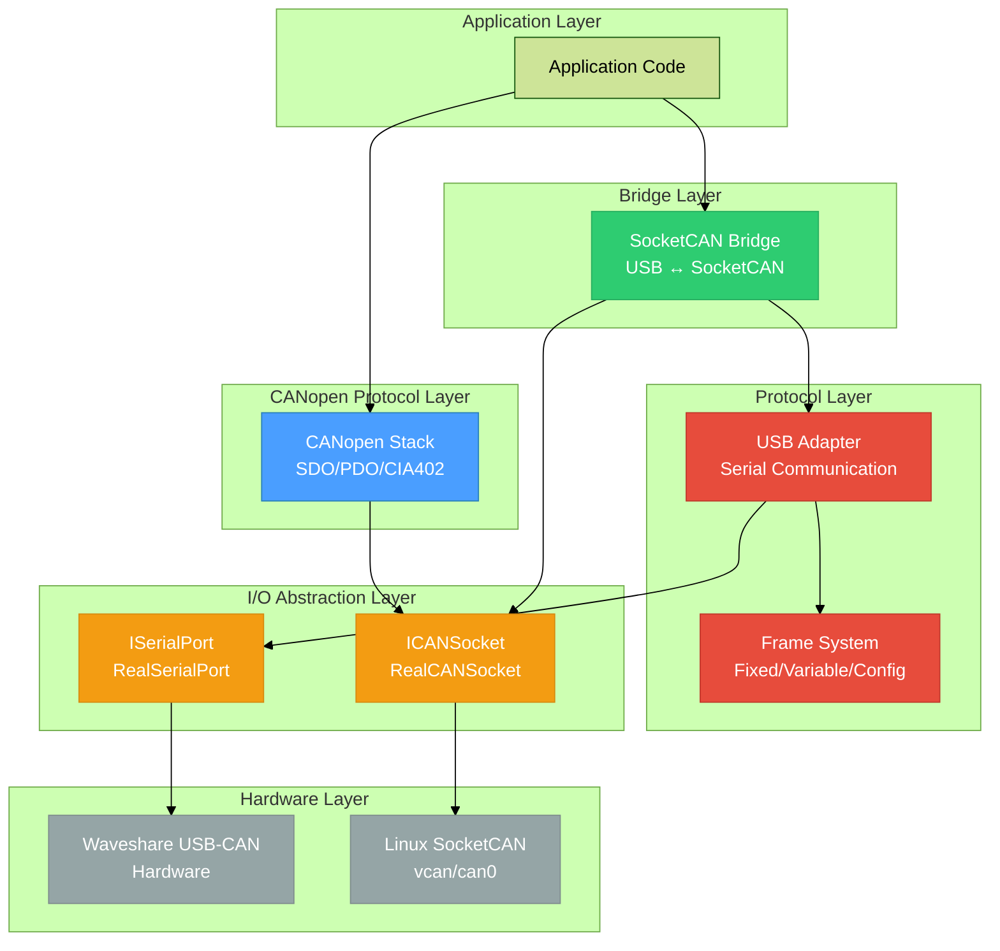

# Waveshare Library - Architecture Overview

High-level view of the library subsystems and their relationships.



## Subsystems

### 1. **CANopen Protocol Layer** 🆕
- **Purpose**: High-level CANopen communication (CIA301/CIA402)
- **Components**: SDOClient, PDOManager, CIA402FSM, ObjectDictionary
- **Dependencies**: ICANSocket (uses SocketCAN directly)
- **Key Feature**: Motor control and industrial automation protocols

### 2. **Bridge Layer**
- **Purpose**: Bidirectional frame forwarding between USB and SocketCAN
- **Components**: SocketCANBridge, BridgeConfig, BridgeStatistics
- **Threading**: Dual-thread architecture for concurrent forwarding
- **Key Feature**: Zero-copy, lock-free performance monitoring

### 3. **Protocol Layer**
- **Purpose**: Waveshare USB-CAN protocol implementation
- **Components**: Frame classes (Fixed/Variable/Config), FrameBuilder, USBAdapter
- **Pattern**: CRTP for zero-overhead abstraction
- **Key Feature**: State-first design with on-demand serialization

### 4. **I/O Abstraction Layer**
- **Purpose**: Hardware abstraction for dependency injection
- **Components**: ISerialPort, ICANSocket, Real* implementations
- **Pattern**: Interface-based design
- **Key Feature**: Enables testing without hardware (Mock implementations)

### 5. **Hardware Layer**
- **Components**: Waveshare USB-CAN adapter, Linux SocketCAN interfaces
- **Access**: Through abstraction layer only
- **Key Feature**: Platform-specific, hidden from higher layers

## Data Flow Examples

### CANopen Motor Control
```
Application → SDOClient → RealCANSocket → vcan0/can0 → Motor
Motor → vcan0/can0 → PDOManager (callbacks) → Application
```

### Bridge Mode
```
Waveshare USB → USBAdapter → VariableFrame → SocketCANBridge → can_frame → vcan0
vcan0 → can_frame → SocketCANBridge → VariableFrame → USBAdapter → Waveshare USB
```

### Direct USB Access
```
Application → FrameBuilder → VariableFrame → USBAdapter → RealSerialPort → USB
USB → RealSerialPort → USBAdapter → VariableFrame → Application
```

## Design Principles

1. **Separation of Concerns**: Each layer has a single, well-defined responsibility
2. **Dependency Injection**: Interfaces enable testing and flexibility
3. **Zero-Copy Where Possible**: Minimize data copying in hot paths
4. **Thread Safety**: Lock-free atomics and careful mutex usage
5. **RAII**: Resource management through constructors/destructors
6. **Compile-Time Optimization**: CRTP and templates for zero overhead
