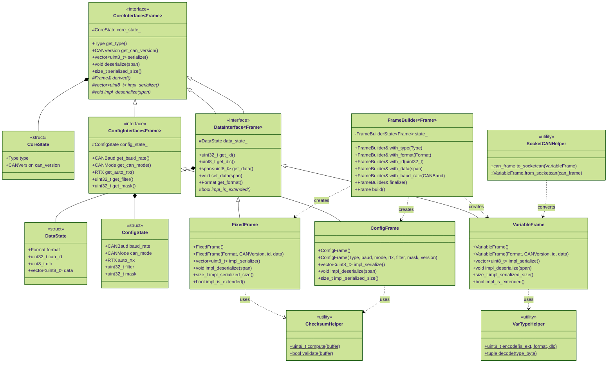

# Frame System - Class Diagram

The frame system implements the Waveshare USB-CAN protocol with a state-first, CRTP-based design.



## Design Patterns

### CRTP (Curiously Recurring Template Pattern)
- **Purpose**: Zero-overhead compile-time polymorphism
- **Implementation**: Base classes call derived() to access frame-specific methods
- **Benefit**: No virtual function overhead, all resolved at compile time

### State-First Architecture
- **CoreState**: Common properties (type, CAN version)
- **DataState**: Data frame properties (ID, DLC, data)
- **ConfigState**: Configuration properties (baud, mode, filters)
- **Benefit**: Clear separation, efficient memory layout

### Builder Pattern
- **Fluent Interface**: Chain method calls for frame construction
- **Validation**: Enforces required fields before build()
- **Type Safety**: Compile-time type checking

## Frame Types

### FixedFrame (20 bytes)
- Fixed-size protocol frame
- Always includes checksum
- Layout: `START | HEADER | TYPE | VERS | FMT | ID(4) | DLC | DATA(8) | RES | CHK`
- **Use case**: Legacy protocol, checksummed communication

### VariableFrame (4-14 bytes)
- Variable-size protocol frame
- No checksum (relies on USB layer)
- Layout: `START | TYPE | ID(1-4) | DATA(0-8)`
- **Use case**: Modern protocol, efficient bandwidth

### ConfigFrame (20 bytes)
- Configuration command frame
- Fixed size with checksum
- Layout: `START | HEADER | TYPE | BAUD | VERS | FILTER(4) | MASK(4) | MODE | RTX | RES | CHK`
- **Use case**: Adapter initialization and configuration

## Usage Example

```cpp
// Build a variable data frame
auto frame = FrameBuilder<VariableFrame>()
    .with_format(Format::DATA_VARIABLE)
    .with_id(0x123)
    .with_data({0x11, 0x22, 0x33})
    .finalize()
    .build();

// Serialize to bytes
auto bytes = frame.serialize();

// Convert to SocketCAN
auto can_frame = SocketCANHelper::to_socketcan(frame);
```
