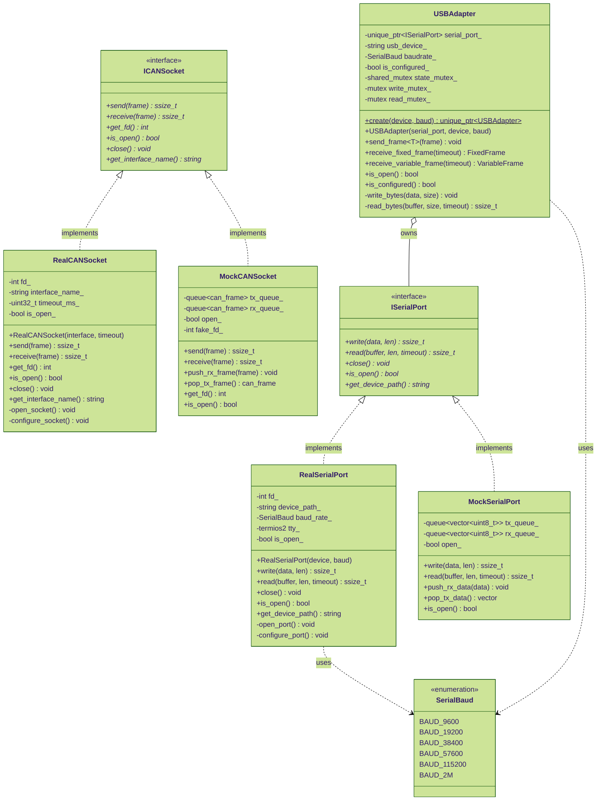

# I/O Abstraction Layer - Class Diagram

Hardware abstraction interfaces enabling dependency injection and testing without physical devices.



## Design Pattern: Dependency Injection

### Interface-Based Abstraction
- **ISerialPort**: Abstract serial communication
- **ICANSocket**: Abstract CAN socket operations
- **Benefit**: Swap implementations without changing client code

### Production Implementations
- **RealSerialPort**: Linux termios2-based serial I/O
- **RealCANSocket**: Linux SocketCAN (AF_CAN sockets)
- **Features**: Proper error handling, configurable timeouts

### Test Implementations
- **MockSerialPort**: Queue-based simulation
- **MockCANSocket**: Queue-based simulation
- **Features**: Inject test data, verify transmitted data

## USBAdapter: Thread-Safe Serial Communication

### Three-Mutex Pattern
1. **state_mutex_ (shared_mutex)**: Protects configuration state (read-heavy)
2. **write_mutex_**: Serializes write operations
3. **read_mutex_**: Serializes read operations (for multi-threaded scenarios)

### Responsibilities
- Frame serialization/deserialization
- Byte-level protocol handling
- Timeout management
- Error recovery

## Platform Support

### Linux (Primary)
- **Serial**: `/dev/ttyUSBx` via termios2
- **CAN**: SocketCAN (vcan, can0, can1, etc.)
- **Features**: Non-blocking I/O, custom baud rates

### Testing (Any Platform)
- **Mock**: No hardware required
- **Queues**: Inject/verify data in unit tests
- **CI/CD**: Runs without physical devices

## Usage Examples

### Production (Real Hardware)
```cpp
// Create real serial port
auto serial = std::make_unique<RealSerialPort>("/dev/ttyUSB0", SerialBaud::BAUD_2M);

// Create USB adapter
auto adapter = std::make_unique<USBAdapter>(std::move(serial), "/dev/ttyUSB0", SerialBaud::BAUD_2M);

// Send frame
VariableFrame frame = ...;
adapter->send_frame(frame);
```

### Testing (Mock Hardware)
```cpp
// Create mock serial port
auto mock_serial = std::make_unique<MockSerialPort>();

// Inject response data
mock_serial->push_rx_data({0xAA, 0x55, 0x12, 0x34});

// Create adapter with mock
auto adapter = std::make_unique<USBAdapter>(std::move(mock_serial), "mock", SerialBaud::BAUD_2M);

// Send frame (captured in mock)
adapter->send_frame(frame);

// Verify transmitted bytes
auto tx_data = mock_serial->pop_tx_data();
```

### CANopen (Direct Socket Access)
```cpp
// Create real CAN socket
auto socket = std::make_shared<RealCANSocket>("vcan0", 1000);

// Use with SDOClient
SDOClient sdo(socket, dictionary, node_id);
uint16_t statusword = sdo.read<uint16_t>("statusword");
```

## Error Handling

### Exceptions
- **DeviceException**: Device not found, permission denied
- **TimeoutException**: Read/write timeout expired
- **ProtocolException**: Invalid frame, checksum error

### Timeout Behavior
- **Blocking**: read() blocks until data or timeout
- **Non-blocking**: Can be configured with timeout=0
- **Retry**: Application decides retry logic
