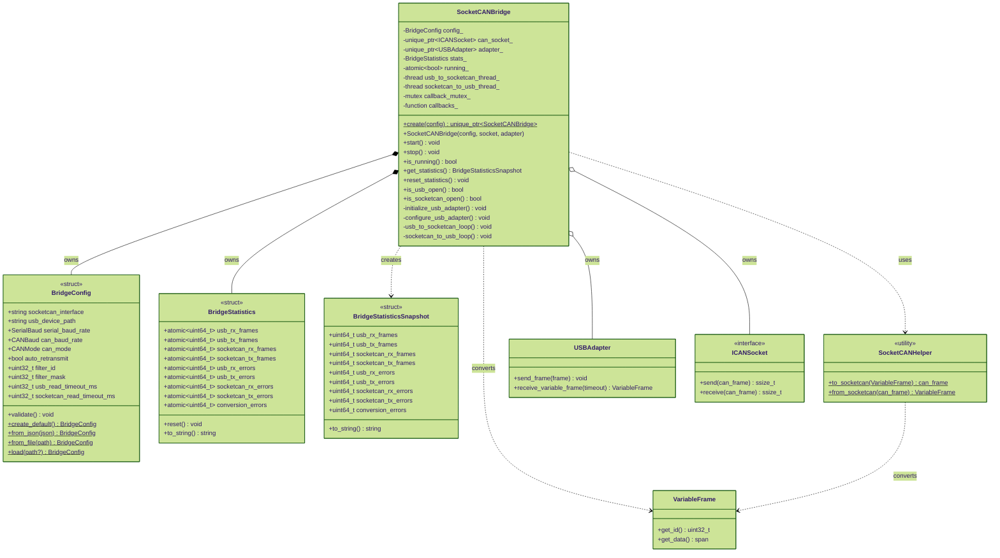

# SocketCAN Bridge - Class Diagram

Bidirectional bridge between Waveshare USB-CAN adapter and Linux SocketCAN with lock-free performance monitoring.



## Architecture

### Dual-Thread Design
```
┌──────────────────────────────────────────────────┐
│          SocketCANBridge                         │
│                                                  │
│  Thread 1: USB → CAN     Thread 2: CAN → USB    │
│  ┌──────────────────┐    ┌──────────────────┐  │
│  │ USB Adapter RX   │    │ SocketCAN RX     │  │
│  │ Frame Conversion │    │ Frame Conversion │  │
│  │ SocketCAN TX     │    │ USB Adapter TX   │  │
│  └──────────────────┘    └──────────────────┘  │
│                                                  │
│  BridgeStatistics (lock-free atomic counters)   │
└──────────────────────────────────────────────────┘
```

### Thread Independence
- **USB → SocketCAN**: Reads from USB, converts VariableFrame → can_frame, writes to SocketCAN
- **SocketCAN → USB**: Reads from SocketCAN, converts can_frame → VariableFrame, writes to USB
- **No Synchronization**: Threads never wait for each other
- **Lock-Free Stats**: Atomic operations for performance counters

## Performance Monitoring

### Lock-Free Statistics
- **Atomic Operations**: `std::memory_order_relaxed` for performance
- **Zero Contention**: No mutexes on hot path
- **Counters**: RX/TX frames and errors per direction
- **Snapshot**: Non-atomic read for reporting

### Counter Types
1. **Frame Counters**: usb_rx/tx, socketcan_rx/tx
2. **Error Counters**: rx_errors, tx_errors per direction
3. **Conversion Errors**: Frame format issues

## Configuration

### Static Configuration (BridgeConfig)
- **CAN Interface**: vcan0, can0, etc.
- **USB Device**: /dev/ttyUSB0, etc.
- **Baud Rates**: Serial (2M typical), CAN (500K typical)
- **Filters**: CAN ID filtering (hardware level)
- **Timeouts**: Read timeouts for both directions

### Runtime Configuration
- **Callbacks**: Optional frame-level monitoring
- **Statistics Reset**: Clear counters on demand
- **Graceful Shutdown**: stop() joins threads cleanly

## Usage Examples

### Basic Bridge Setup
```cpp
// Create configuration
auto config = BridgeConfig::create_default()
    .with_socketcan_interface("vcan0")
    .with_usb_device("/dev/ttyUSB0")
    .with_serial_baud(SerialBaud::BAUD_2M)
    .with_can_baud(CANBaud::BAUD_500K);

// Create and start bridge
auto bridge = SocketCANBridge::create(config);
bridge->start();

// Monitor statistics
auto stats = bridge->get_statistics();
std::cout << stats.to_string() << std::endl;

// Stop bridge
bridge->stop();
```

### With Dependency Injection (Testing)
```cpp
// Create mocks
auto mock_socket = std::make_unique<MockCANSocket>();
auto mock_adapter = std::make_unique<USBAdapter>(...);

// Create bridge with mocks
auto bridge = std::make_unique<SocketCANBridge>(
    config,
    std::move(mock_socket),
    std::move(mock_adapter)
);

// Test without hardware
bridge->start();
// ... inject frames via mocks ...
bridge->stop();
```

### Load Configuration from File
```cpp
// From JSON file
auto config = BridgeConfig::from_file("config/bridge_config.json");
auto bridge = SocketCANBridge::create(config);

// With environment variable overrides
auto config = BridgeConfig::load("config/bridge_config.json");
auto bridge = SocketCANBridge::create(config);
```

## Error Handling

### Initialization Errors
- **DeviceException**: USB device not found
- **CANException**: SocketCAN interface unavailable
- **ConfigException**: Invalid configuration parameters

### Runtime Errors
- **Non-Fatal**: Logged to stderr, statistics updated
- **Recovery**: Threads continue running
- **Graceful**: stop() ensures clean shutdown

## Thread Safety

### Deadlock Prevention
1. **Independent Threads**: No inter-thread waiting
2. **Lock-Free Statistics**: Atomic operations only
3. **Timeout-Based I/O**: All blocking ops have timeouts
4. **Unidirectional Flow**: Each thread owns one direction

### Memory Ordering
- **Statistics**: `std::memory_order_relaxed` (sufficient for counters)
- **Control Flags**: Sequential consistency (correctness critical)

## Performance Characteristics

### Throughput
- **USB → SocketCAN**: ~1000 fps (typical)
- **SocketCAN → USB**: ~1000 fps (typical)
- **Latency**: <1ms per frame (typical)

### Resource Usage
- **Threads**: 2 (one per direction)
- **Memory**: ~100 KB (stack + buffers)
- **CPU**: <5% on modern hardware
